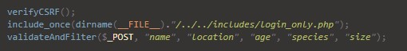

# Elements:
 - Nuno Marques (201708997) 
 - João Rodrigo (201705110)
 
# Credentials (username/password (role))
 - utilizador/asdasd2 (client)
 - myuser/asdasd2 (client)
 - myuser/asdasd2 (client)

# Libraries:
 - No external libraries were used for this project

# Features:
 - Security
    
    

     - XSS: yes
        -Input is filtered:
            ```php
            function validateAndFilter(&$array, ...$vars)
            {
                $missing = [];

                foreach ($vars as $var) {
                if (!isset($array[$var])) {
                    array_push($missing, 'Request missing element \''.$var.'\' ');
                } else {
                    $array[$var] = preg_replace('/[^a-zA-Z0-9çéèêáàãôóòíìúù \']/', '', $array[$var]);
            }
            ...
            ```

     - CSRF: yes
     - SQL using prepare/execute: yes
     - Passwords: PHP Hashing algorithm(BCRYPT)
     - Data Validation: regex / php / html / ajax

 - Technologies
     - Separated logic/database/presentation: yes
     - Semantic HTML tags: yes
     - Responsive CSS: yes
     - Javascript: yes
     - Ajax: yes
     - REST API: no
     - Other:
  Usability:
     - Error/success messages: yes
     - Forms don't lose data on error: yes

